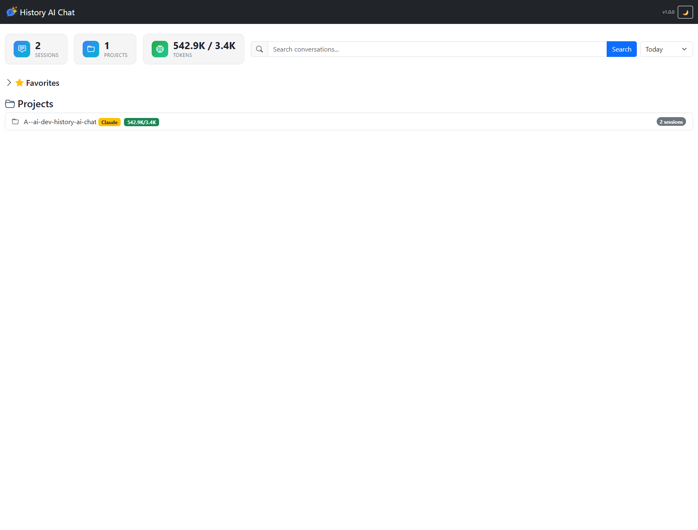
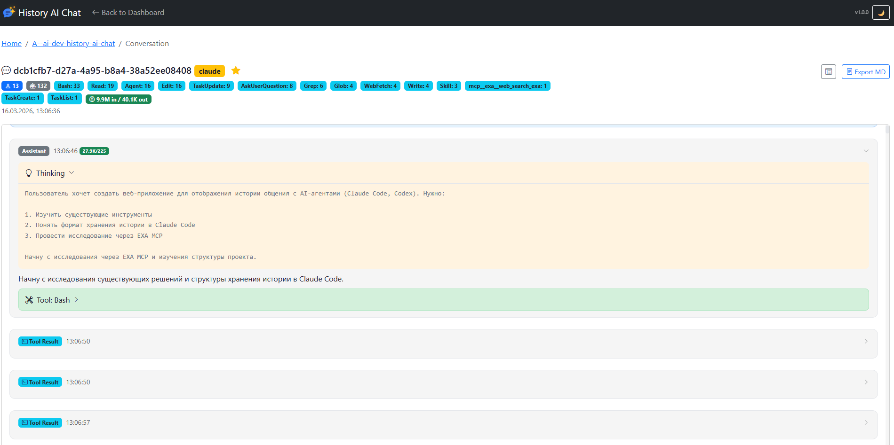

# History AI Chat

**Просматривай историю диалогов Claude Code и Codex CLI в браузере.**

Веб-приложение для парсинга JSONL-файлов Claude Code и Codex CLI с удобным интерфейсом: навигация по проектам, поиск, статистика токенов, избранные сессии, экспорт диалогов.

## Функционал

- **Dashboard** — обзор всех проектов с агрегированной статистикой токенов
- **Навигация** — список сессий по проектам с предпросмотром первого сообщения
- **Чтение диалогов** — подсветка синтаксиса, сворачивание tool calls, блоки thinking
- **Статистика токенов** — input/output/cache breakdown для каждой сессии
- **Поиск** — полнотекстовый поиск по всем диалогам
- **Избранное** — отметка важных сессий (SQLite cache)
- **Экспорт** — markdown для каждого диалога
- **Desktop** — системный трей, автозапуск браузера

## Скриншоты

| Dashboard | Диалог |
|----------|--------|
|  |  |

## Быстрый старт

```bash
# Windows
run.bat

# Linux/macOS
python -m venv venv && source venv/bin/activate
pip install -e .
python -m uvicorn viewer.main:app --host 127.0.0.1 --port 6300
```

Откроется http://localhost:6300 с отбором за текущую дату

## Требования

- Python 3.10+
- Windows / Linux / macOS

## Использование

### Где искать данные

Приложение автоматически находит JSONL-файлы:

| Платформа | Путь по умолчанию |
|-----------|-------------------|
| Claude Code | `~/.claude/projects/` |
| Codex CLI | `~/.codex/sessions/` |

Переопределить через переменные окружения:

```bash
CLAUDE_PROJECTS_PATH=/path/to/claude/projects
CODEX_SESSIONS_PATH=/path/to/codex/sessions
```

### Сборка exe

Автономный исполняемый файл для Windows без установки Python. Иконка в системном трее с быстрым доступом к браузеру:

```bash
# Windows
build.bat 

# или
pip install -e ".[build]"
pyinstaller build.spec --clean
```

**Результат:** `dist/history-ai-chat.exe` (~35 MB)

**Особенности:**
- Иконка в системном трее
- Автооткрытие браузера при запуске
- UPX-сжатие (опционально)

## Стек технологий

| Слой | Технология |
|------|------------|
| Backend | FastAPI, Uvicorn |
| Frontend | Jinja2, HTML/CSS |
| Парсинг | Python dataclasses |
| Подсветка | Pygments |
| Кэш | SQLite |
| Desktop | PyStray, Pillow |
| Сборка | PyInstaller |

## Архитектура

```
src/viewer/
├── main.py              # FastAPI app, API endpoints
├── cli.py               # CLI entrypoint
├── desktop.py           # Desktop (system tray) entrypoint
├── parsers/
│   ├── claude.py        # Claude Code JSONL parser
│   └── codex.py         # Codex CLI parser
├── db/
│   └── cache.py         # SQLite (favorites)
├── templates/           # Jinja2 HTML
└── static/css/          # Тема
```

### API Endpoints

| Endpoint | Описание |
|----------|----------|
| `GET /` | Dashboard |
| `GET /project/{id}` | Страница проекта |
| `GET /conversation/{id}` | Страница диалога |
| `GET /api/projects` | Список проектов с токенами |
| `GET /api/sessions/{id}` | Сессии проекта |
| `GET /api/conversation/{id}` | Полный диалог |
| `GET /api/search?q=` | Поиск |

## Разработка

```bash
pip install -e ".[dev]"
python -m pytest tests/ -v
```

## Лицензия

MIT